**[PT-BR ]** |   **[[ENG 🇺🇸 ]](README.en.md)**

# Pedro Carnio (Shadow_Voidh)
> **Estudante de TI & Desenvolvedor de Software / Game Dev**

Apaixonado por tecnologia, desenvolvimento de software e arquitetura de jogos. Minha trajetória começou pela curiosidade em entender o funcionamento interno dos games e sistemas, o que me levou a focar em programação low-level, desenvolvimento web e engenharia de software.

  

---

## 🎯 Foco Atual
* 🚀 **Aprofundando em:** C++, C# e Rust para desenvolvimento de aplicações de alta performance e sistemas.
* 📚 **Formação:**  Fazendo Ensino Médio Técnico em Tecnologia da Informação.

---

## 🛠️ Tecnologias & Habilidades

## ⚙️ Low-Level & Linguagens de Sistemas
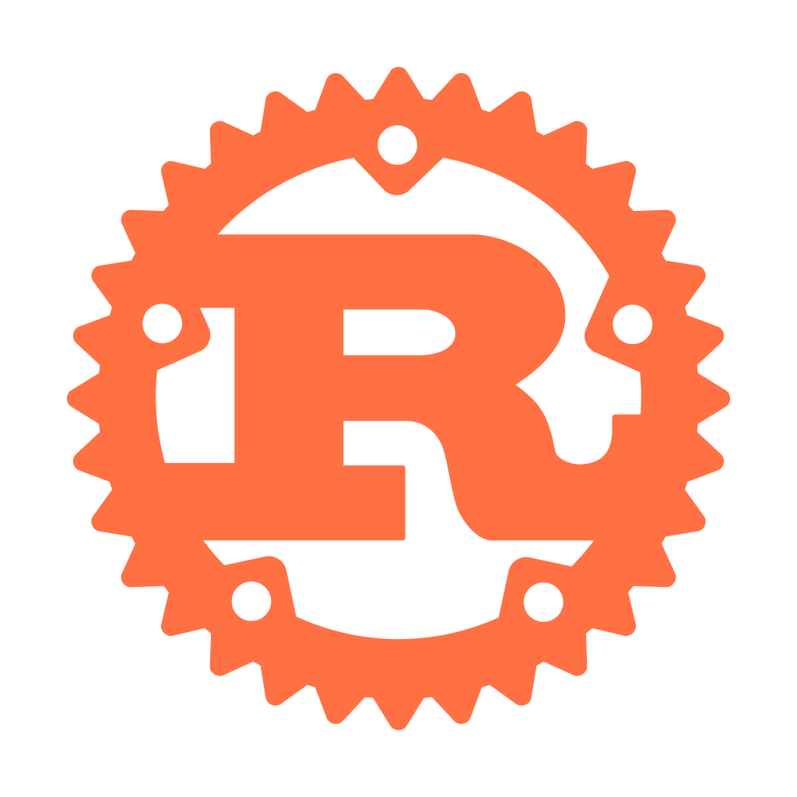 `Rust`  
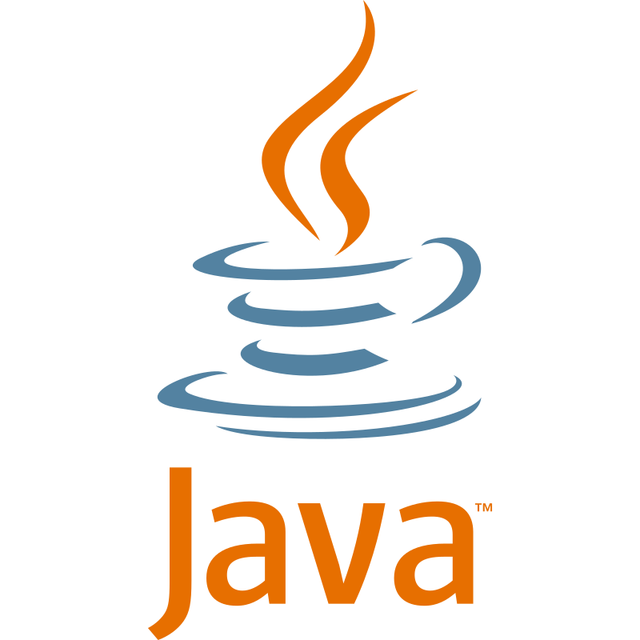  `Java`   
  `C`  
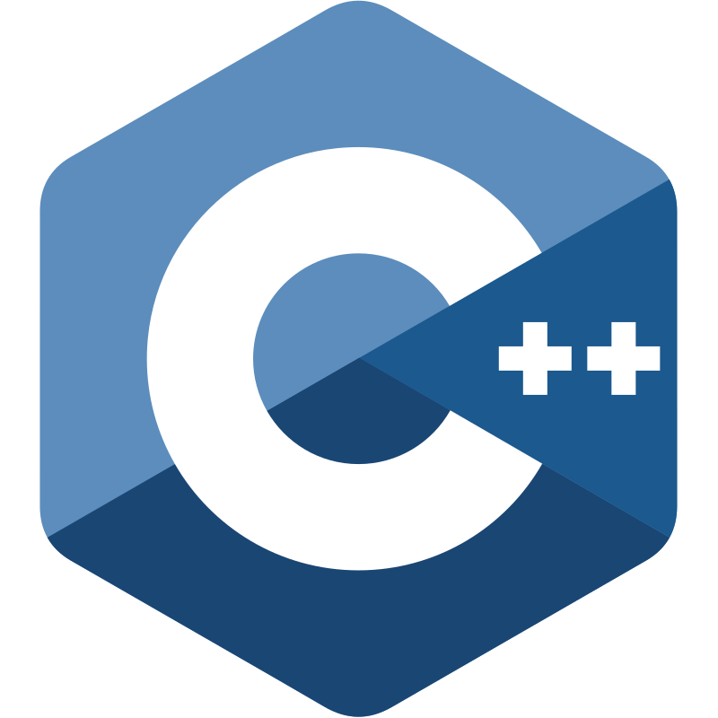  `C++`  
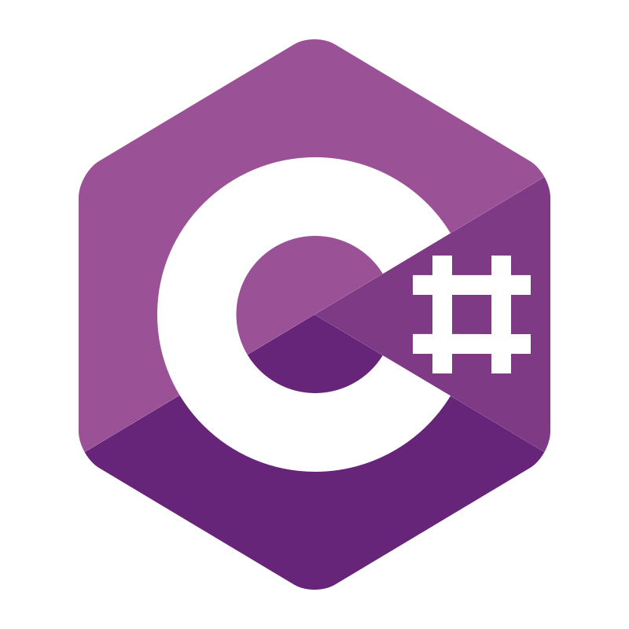  `C#`  
  `Go`  
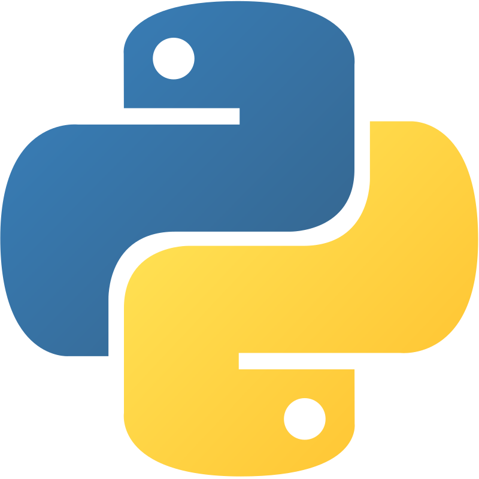  `Python` 

## 🌐 Desenvolvimento Web & Back-End
  `TypeScript`   
  `JavaScript`   
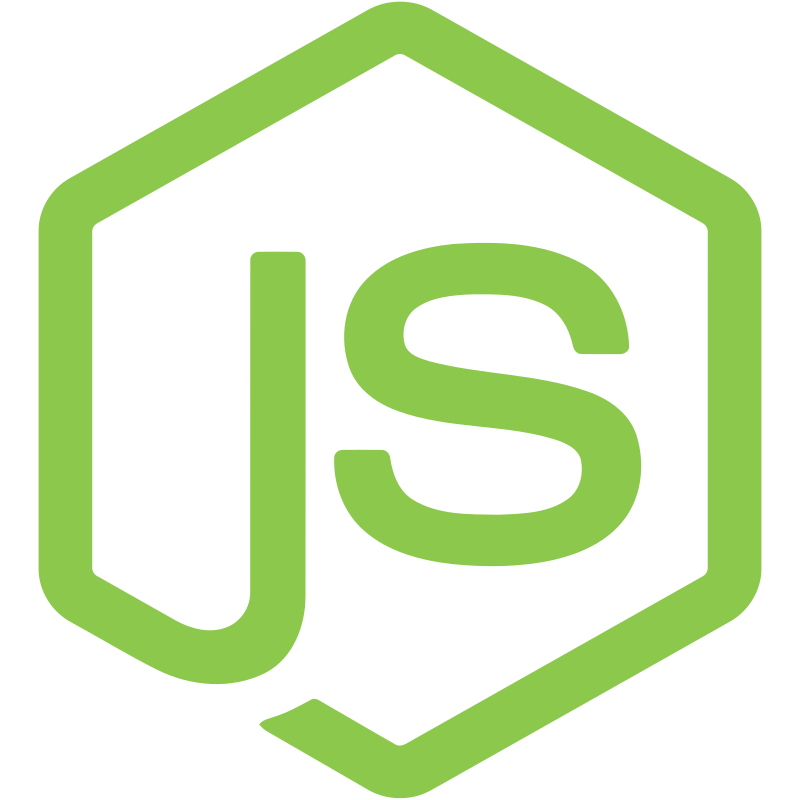  `Node.js`  
  `Next.js`   
 `React`   
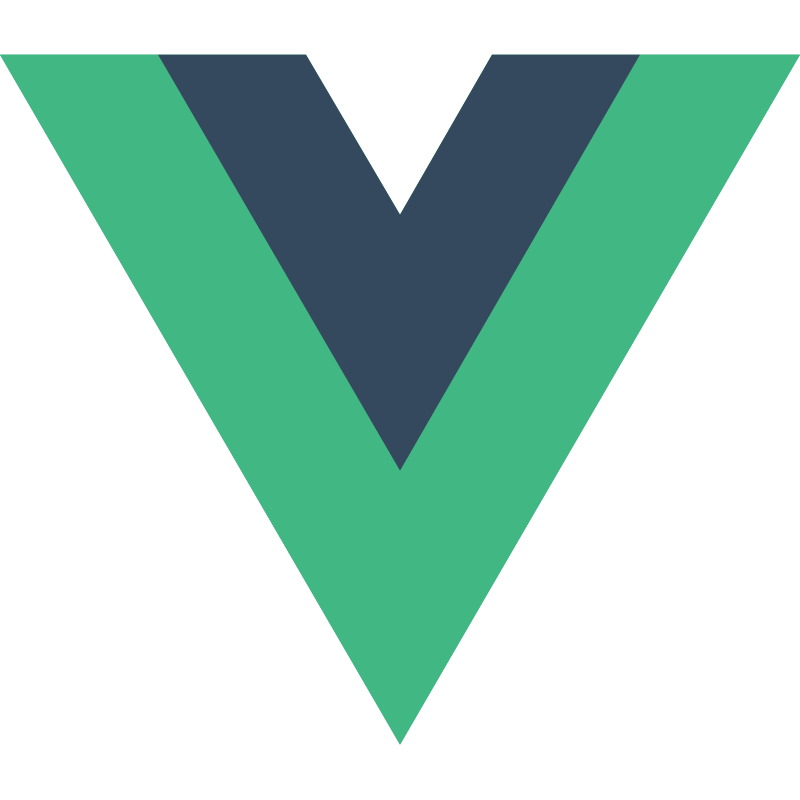 `Vue.js`   
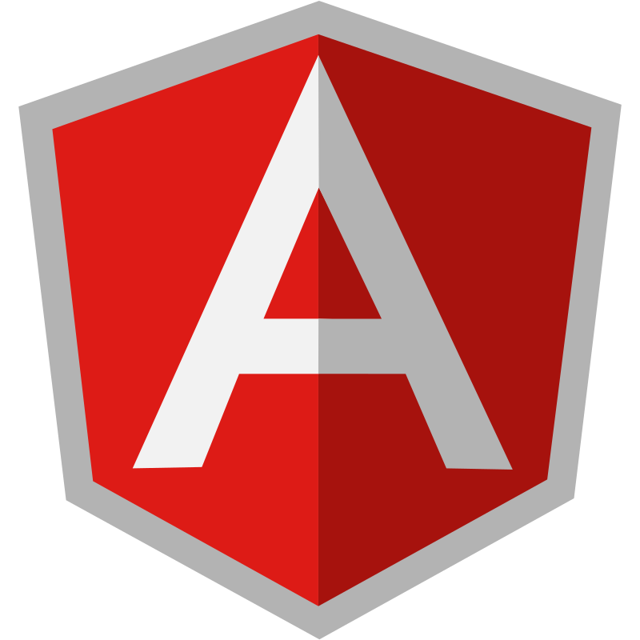 `Angular`  
 `PHP`   
 `HTML5`   
 `CSS3`   
 `Tailwind CSS` 

## 🗄️ Bancos de Dados
  `MySQL`   
  `SQLite`   
  `PostgreSQL` 

## 🗒️ IDEs
  `VS Code`  
  `Visual Studio`  
  `IntelliJ`  
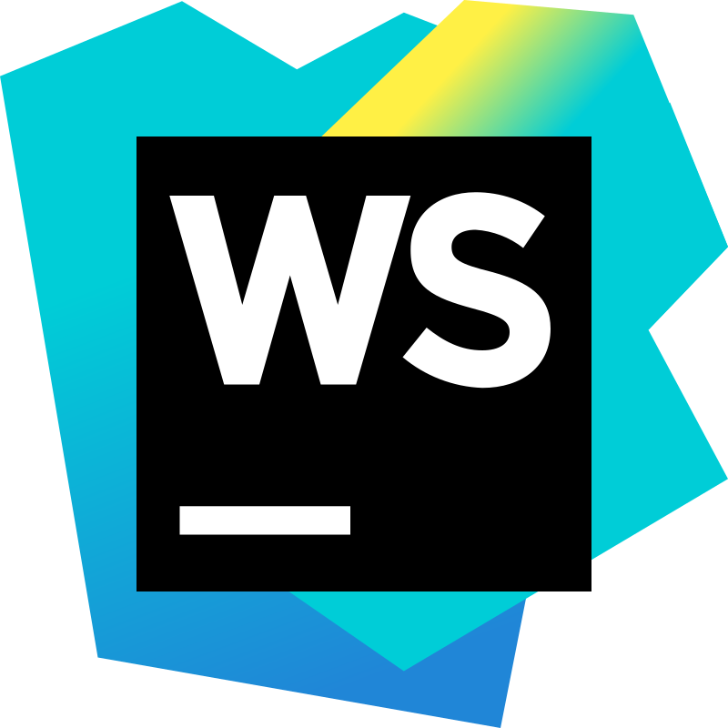  `WebStorm`  
  `Eclipse`

##  🔧 Ferramentas 
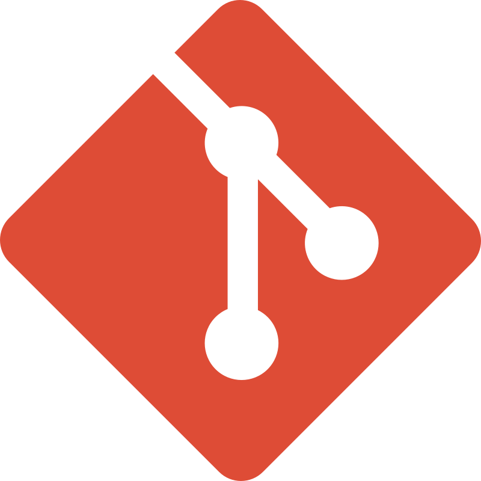  `Git`  
  `Docker`  
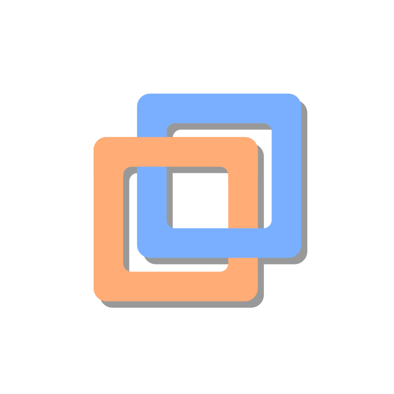  `Vmware`  
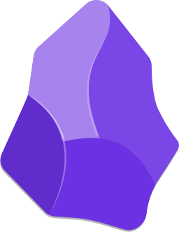  `Obsidian`  
 `Filezilla`  
 `Blender`   
 `Excel `

## 🤖 IAs 
  `Claude AI`  
  `Gemini AI`  
  `ChatGPT `  

## 🌐 Web

## 💻 OS 
 `Windows 10 & 11`  
 `macOS 13` `(uso desde Agosto de 2026)`  
#### 🐧 Distro Linux
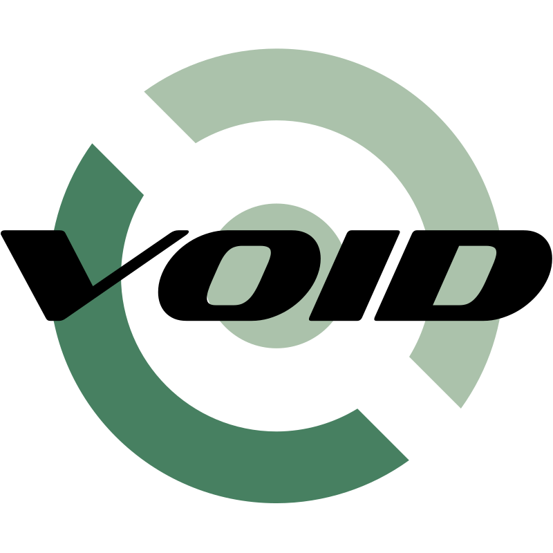 `Void` `(uso desde setembro de 2025)`  
 `Mint` `(uso desde janeiro de 2025)`  
 `Ubuntu` `(uso desde outubro de 2026)`  
  `Zorin` `(usado de maio a outubro de 2026)`

---

## 📜 Trajetória & Evolução Técnica

* **2019 – 2021 | Primeiros Passos em Lógica e 3D**  
  Desenvolvimento de mecânicas de jogo e scripts em **Lua**, aliados à modelagem 3D na plataforma Roblox.

* **2023 | Automação e Integrações**  
  Criação de bots e automações em **Python** integrados à API do Discord, aprofundando conceitos de lógica de programação e manipulação de APIs.

* **2025 | Formação Técnica e Fundamentos**  
  Início do **Ensino Médio Técnico em TI**, consolidando base sólida em algoritmos, orientação a objetos e bancos de dados relacionais (**C**, **Python**, **HTML5/CSS3**, **JavaScript**, **MySQL**, **SQLite**).

* **Final de 2025 | Linguagens de Sistemas e Backend**  
  Expansão do ecossistema de linguagens compiladas e concorrentes com foco em performance e escalabilidade (**Go**, **Rust**, **TypeScript**, **Node.js**, **Java**).

* **2026 | Arquitetura Frontend & Frameworks Modernos**  
  Especialização no ecossistema moderno de desenvolvimento Web e reatividade (**React**, **Vue.js**, **Next.js**, **Tailwind CSS**).
  
* **Atualmente:** Foco total no aprendizado de **TSX e RUST & JAVA** voltados para projetos nativos, jogos e engenharia de software.  

---
### ☀ Projetos em Destaque

<h1>Web</h1>

🌐 **[DevSpace](https://github.com/shadowvoidh/DevSpace)** – Workspace de desenvolvimento tudo-em-um com gerenciador de snippets em Markdown, gerenciador de tarefas (To-Do) e links rápidos para código. Desenvolvido com Go, SQLite, Vue 3, Next.js, TypeScript e Tailwind CSS.
   
* 🌐 ****   *     

<h1>Java</h1>

* ☕ ****   *   
* ☕ ****   *     

<h1>Python</h1>

* 🐍 **[Ram Price Tracker](https://github.com/shadowvoidh/Ram-Price-Tracker)** – Um script em Python desenvolvido para simular, monitorar e registrar a flutuação de preços de memórias RAM (DDR4 e DDR5)*   
* 🐍 ****   *     

---

### 📊 Estatísticas do GitHub

  
  

---

## 🌘Autor
* *Shadow_Voidh:* [Github](https://github.com/shadowvoidh)

## 📬 Contato
* *GitHub:* [@shadowvoidh](https://github.com/shadowvoidh)
* *Instagram:* [@shadow_voidh](https://www.instagram.com/shadow_voidh/)
* *LinkedIn:* [Pedro Carnio](https://linkedin.com/in/pedrocarnio)
* *Discord:* shadow_voidh
* *E-mail:* shadow.voidh@gmail.com
